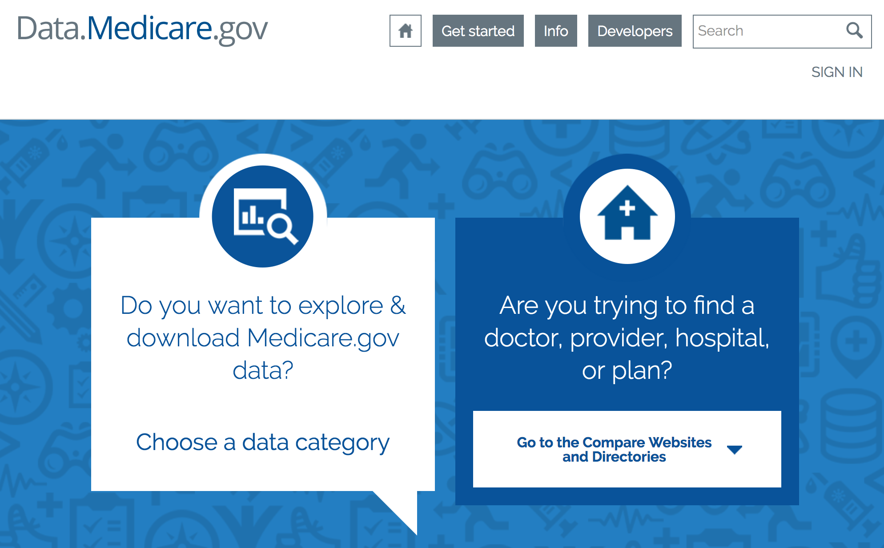

# **Capstone Project 01 Data Cleaning**
# _Insights into hospital readmission using medicare's public data bases_
####  by: Julio Cárdenas-Rodríguez

## Steps
1. _Find dataset and become familiar with data._      
I had to read the data dictionary from medicare to understand the meaning of each variable and the available tables. The dictionary is located 
2. Hola

Now that you have a basic ideas of the various data wrangling steps and techniques available, let's apply it to your Capstone Project! By now, you probably have a data set in mind for your project (If you don't have a data set yet, come back to this assignment once you have one). Apply some of the data wrangling techniques you have learned to this data set.

Submission: Create a short document (1-2 pages) in your github describing the data wrangling steps that you undertook to clean your capstone project data set. What kind of cleaning steps did you perform? How did you deal with missing values, if any? Were there outliers, and how did you decide to handle them? This document will eventually become part of your milestone report.
