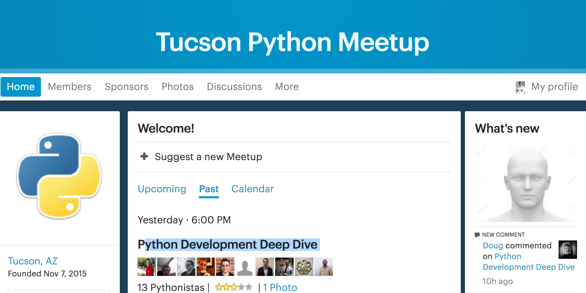

Report on Data Science related Meet Up.
=======================================

## [Tucson Python Meet Up](https://www.meetup.com/Tucson-Python-Meetup/)
### Event: Python Development Deep Dive
### Date: February 21st, 2017
### Location : University of Arizona

#### Presenter
Doug Wellington has been a professional system administrator and developer for 30 years, starting as a Novell Netware guy in a mainframe shop at Tucson Medical Center in 1987 and then working at various departments at The University of Arizona and the US Geological Survey.  He currently works for a DSP software development company in Tucson.

### Description
Doug's presentation was mostly high-level view of the way he works with python instead of following along some coding. The follow topics were discussed:  
1. Development set up using Anaconda
2. Version control with Github and Mercurial
3. Code Analysis with Pylint and Doc (NEW AND VERY USEFUL)
4. Unit testing.

#### Pros
1. Meeting other Python users.
2. Make contacts to expand my network.
3. Learned about Pylint

#### Cons
1. Disorganized presentation
2. Little new material
