# Insights into the I-SPY clinical trial
#### by Julio Cardenas-Rodriguez (@jdatascientist)

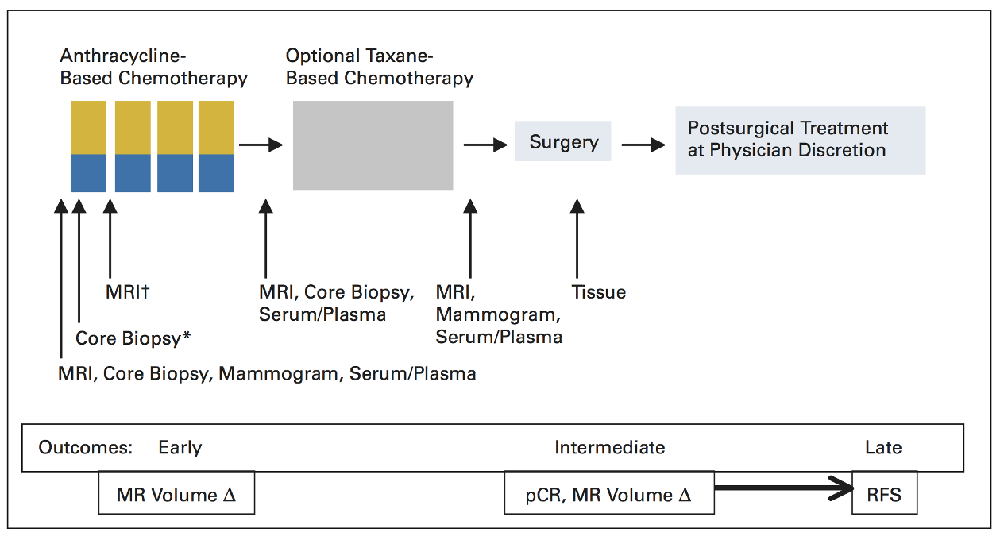

## 1. Description and Objectives
The goal of this project is to improve the prediction of clinical outcomes to neoadjuvant chemotherapy in patients with breast cancer. Currently, most patients with breast cancer undergo neoadjuvant chemotherapy, which is aimed at reducing the size of a tumor (burden) before surgery to remove the tumor or the entire breast.   
Some of the patients response completely to the therapy and the patient does not present any residual tumor at the time of surgery (Pathologic complete response or `PCR`). On the other hand, most patients have residual disease at the time of surgery and further treatment or surgery is required.

## 2. Data source
All data for the **222 patients** treated for breast cancer in the IPSY-1 clinical trial was obtained from the [cancer imaging archive](https://wiki.cancerimagingarchive.net/display/Public/ISPY1) and the Breast Imaging Research Program at UCSF. To facilitate the dissemination and reproducibility of this analysis, the raw data and all code were posted at [Data.World](https://data.world/julio/ispy-1-trial) and [Github](https://github.com/JCardenasRdz/Insights-into-the-I-SPY-clinical-trial) and are available under an MIT license.

## 3. Source code in Python and data analysis
The code is organized in a Python package (`ispy1`), with modules for each of the four steps of the data analysis

> - ispy1
>   - clean_data.py
>   - inferential_statistics.py
>   - predictive_statistics.py
>   - survival_analysis.py

## 4. Description of the data
> The data contained in the cancer imaging archive is organized column-wise for all subjects as follows (rows = patients).

**Clinical Outcomes**
1. Survival Status at the end of the study (`Survival`):
    - 7 = Alive
    - 8 = Dead
    - 9 = Lost to follow up
2. Length of Survival (`Survival_length`):
    - Days from study entry to death or last follow-up
3. Recurrence-free survival (`RFS`):
    - days from from NCAC start until progression or death
4. Recurrence-free survival indicator (`RFS_code`)
    - progression or death (1),
    - removed from survival curve (0)
5. Pathologic Complete Response (`PCR`) post-neoadjuvant ?:
    - 1 = Yes
    - 0 = No
    - Lost (Blank)
6. Residual Cancer Burden class (`RCB`):
    - 0 = RCB index (Class 0)
    - 1 = RCB index less than or equal to 1.36 (Class I)
    - 2 = RCB index greater than 1.36 or equal to 3.28  (Class II)
    - 3 = III, RCB index greater than 3.28 (Class III)
    - Blank = unavailable or no surgery

**Predictors of clinical outcomes**
1. `Age` (Years)
2. `Race`, encoded as:
    - 1 = Caucasian
    - 3 = African American
    - 4 = Asian
    - 5 = Native Hawaiian
    - 6 = American Indian
    - 50 = Multiple race
3. Estrogen Receptor Status (`ER+`) encoded as:
    - 1 = Positive
    - 0 = Negative
    - Blank = Indeterminate
4. Progesterone Receptor Status (`PR+`) encoded as:
    - 1 = Positive
    - 0 = Negative
    - Blank = Indeterminate
5. Hormone Receptor Status (`ER+`)
    - 1 = Positive
    - 0 = Negative
    - Blank = Indeterminate
6. Bilateral Breast Cancer (`Bilateral`):
    - 1 = Cancer Detected on both breasts
    - 0 = Cancer Detected in a single breast
7. Breast with major or single Tumor (`Laterality`):
    - 1 = Left breast
    - 2 = Right breast
8. Largest tumor dimension at Baseline estimated by MRI (`MRI_LD_Baseline`, continous variable)
9. Largest tumor dimension 1-3 days after NAC estimated by MRI (`MRI_LD_1_3dAC`, continous variable)
10. Largest tumor dimension between cycles of NAC estimated by MRI (`MRI_LD_Int_Reg`, continous variable)
11. Largest tumor dimension before surgery estimated by MRI (`MRI_LD_PreSurg`, continous variable)

## 5. Data cleaning and organizing
The data for this study was provided as an excel file (.xls) with multiple fields and is not suitable to construct the contingency tables required for inferential statistics or to peform predictive statistics using `sklearn` and `statsmodels`. The module `clean_data` of the `ipsy1` was used to clean the data and generate a pandas dataframe. The code for  `clean_data` module can be found [here](https://gist.github.com/JCardenasRdz/75dd152afe6250a5c7de2315b2a2a960).  

```Python
# load module by Julio and pandas
from ispy1 import clean_data
import pandas as pd

file = './data/I-SPY_1_All_Patient_Clinical_and_Outcome_Data.xlsx'
df = clean_data.clean_my_data(file)
df.head(2)

# save clean data in new  csv file
df.to_csv('./data/I-SPY_1_clean_data.csv')
df.head(2)
```
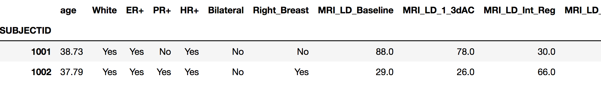

## 6. Inferential Statistics
The objective of inferential statistics is to estimate information about populations and test if two (or more) populations are statistically the same. The analysis for this project is organized according to the type of predictors ( categorical or continous) and their effect on categorical outcomes.
- Load data

```Python
# standard modules
import seaborn as sns
import pandas as pd
import matplotlib.pyplot as plt

# module wrote by julio
from ispy1 import inferential_statistics
df = pd.read_csv('./data/I-SPY_1_clean_data.csv')
```
1. Inferential_statistics: Categorical vs Categorical (Chi-2 test)   

The first thing needed to perform this kind of analysis is to construct contingency tables to establish the frequency of observations for each category being studied for example:

```Python
>>> inferential_statistics.contingency_table('PCR', 'ER+',df)
ER+   Yes    No
PCR            
Yes  17.0  28.0
No   81.0  42.0
```
Now, we can perform the chi-2 test to the effect of multiple categorical predictors on `PCR`:

- Effect of categorical predictors on Pathological complete response (`PCR`)
```Python
>>> predictors = ['White', 'ER+', 'PR+', 'HR+','Right_Breast']
>>> outcome = 'PCR'
>>> inferential_statistics.categorical_data(outcome, predictors, df)
               p-value  Relative_Risk   RR_lb   RR_ub
White         0.833629         0.8878  0.5076  1.5528
ER+           0.001988         0.4337  0.2582  0.7285
PR+           0.000198         0.3219  0.1707  0.6069
HR+           0.000307         0.3831  0.2286  0.6422
Right_Breast  0.851883         1.0965  0.6649  1.8080
```

These results indicate that because `ER+`,`PR+`, and `HR+` show a p-value < 0.05 we reject the null hypothesis of indepedence and conclude that `PCR` is not independent from `ER+`,`PR+`, and `HR+`. Furthermore, the relative risk indicates that `ER+`,`PR+`, and `HR+` are associate with reduce probability of `PCR`, in other words, being positive for these markers reduce the chances of responding to the NAC.

- Effect of categorical predictors on Pathological complete response (`Alive`)
```Python
>>> outcome = 'Alive'
>>> inferential_statistics.categorical_data(outcome, predictors, df)
               p-value  Relative_Risk   RR_lb   RR_ub
White         0.439359         1.0935  0.9032  1.3239
ER+           0.001135         1.3095  1.1025  1.5554
PR+           0.162557         1.1266  0.9739  1.3031
HR+           0.038917         1.1950  1.0094  1.4148
Right_Breast  0.729139         0.9602  0.8287  1.1125
```

These results indicate that because `ER+`,and `HR+` have a mild effect on the chances of survival (p-value < 0.5), but they relative risk indicates that the effect is very close to 1.0, meaning that being `ER+` or `HER+` has little effect on survival according to the chi-2 test, a complete survival analysis is performed in section 3.0.   


2. Inferential_statistics: Continous vs Categorical (ANOVA)   

An analysis using continous predictors for a categorical outcome requires using analysis of variance (ANOVA). I implemented this technique in the `inferential_statistics` module of `isp1`.

- Effect of Age on PCR

```Python
>>> predictor= ['age']
>>> outcome = 'PCR'
>>> anova_table, OLS = inferential_statistics.linear_models(df, outcome, predictor);
---------------------------------------------
             sum_sq     df         F    PR(>F)
age        0.256505    1.0  1.302539  0.255394
Residual  32.689923  166.0       NaN       NaN
---------------------------------------------
```
Age clearly does not have an effect (is associated) with PCR. The effect so small that we can even conclude this just by looking at a grouped histogram:  

```Python
>>> sns.boxplot(x= outcome, y=predictor[0], data=df, palette="Set3");
>>> plt.show()
```
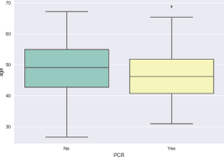


- Effect of `Age` on survival (`Alive`)

The ANOVA for this interaction indicates that `Age` has an effect on survival (`Alive`). It technically would bot be significant at the 95% confidence level (p-value = 0.06), but it would at the 94% confidence level.

```Python
>>> predictor= ['age']
>>> outcome = 'Alive'
>>> anova_table, OLS = inferential_statistics.linear_models(df, outcome, predictor);
---------------------------------------------
             sum_sq     df         F    PR(>F)
age        0.062227    1.0  0.399719  0.528104
Residual  25.842534  166.0       NaN       NaN
---------------------------------------------
```

A simple boxplot shows that older patients are less likely to be `Alive` by the end of this study.

```Python
>>> sns.boxplot(x= outcome, y=predictor[0], data=df, palette="Set3");
<matplotlib.axes._subplots.AxesSubplot object at 0x111aff080>
>>> plt.show()
```

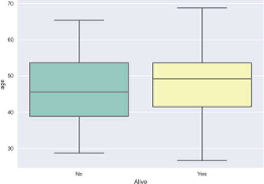

- Explore interactions between age, survival, and PCR

A very interesting fact about NAC and `PCR`, is that not all patients who achieve `PCR` survive until the end of the study. As you can see below, 4 out of 41 patients who achieved `PCR` did not survive until the end of the study, while 95 / 123 who patients who did NOT achieve  `PCR` still lived until the end of the study.

```Python
>>> inferential_statistics.contingency_table('PCR', 'Alive',df)
Alive   Yes    No
PCR              
Yes    41.0   4.0
No     95.0  28.0
```
Thus, there must be other factors (covariates) that can account for this difference. We can explore the effect of `Age` first by creating a histogram that splits the groups in four according to `PCR` = Yes / No and `Alive` = Yes / NO.
```Python
# create a boxplot to visualize this interaction
>>> ax = sns.boxplot(x= 'PCR', y='age', hue ='Alive',data=df, palette="Set3");
>>> ax.set_title('Interactions between age, survival, and PCR');
>>> plt.show()
```
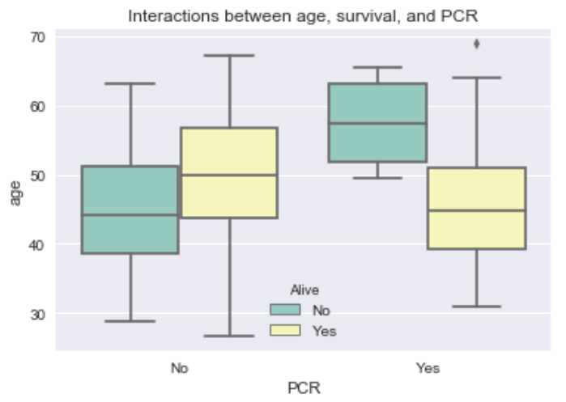

It is evident from the boxplots that `Age` has an effect on on survival and it is affected by the `PCR` status. For example, younger patients with `PCR` = Yes seem more likely to be alive by the end of the study. We can perform ANOVA only for patients for whom `PCR` = Yes. The table below shows that the p-value is < 0.01, which means that we are confident at the 99% level that age has an effect on survival for those patients with `PCR` =Yes.

```Python

# create dataframe only for patients with PCR = Yes
>>> df_by_PCR = df.loc[df.PCR=='Yes',:]

# Anova age vs Alive
>>> predictor= ['age']
>>> outcome = 'Alive'
>>> anova_table, OLS = inferential_statistics.linear_models(df_by_PCR, outcome, predictor);
---------------------------------------------
            sum_sq    df         F    PR(>F)
age       0.539468   1.0  7.470952  0.009065
Residual  3.104976  43.0       NaN       NaN
---------------------------------------------
```

The same analysis can be repeated for patients with `PCR` = No. Which results in a p-value of ~ 0.060, which is not statistically significant at the 5% confidence level but is fairly close. In other words, `age`, `PCR`, and `Alive` interact very strongly. The effect of these interactions will be quantified in the predictive statistics section using logistic regression.

```Python

# create dataframe only for patients with PCR = Yes
>>> df_by_PCR = df.loc[df.PCR=='No',:]

# Anova age vs Alive
>>> predictor= ['age']
>>> outcome = 'Alive'
>>> anova_table, OLS = inferential_statistics.linear_models(df_by_PCR, outcome, predictor);
---------------------------------------------
             sum_sq     df         F    PR(>F)
age        0.637369    1.0  3.674443  0.057611
Residual  20.988648  121.0       NaN       NaN
---------------------------------------------
```

-  Effect of MRI measurements on `PCR` : ANOVA
As part of this study, the largest tumor dimension (`LD`) was measured for all patients at for different time points:
1. `MRI_LD_Baseline`: Before the first NAC regime is started.
2. `MRI_LD_1_3dAC`: 1-3 days after starting the first NAC regime.
3. `MRI_LD_Int_Reg`: Between the end of the first regime and the start of the second regime.
4. `MRI_LD_PreSurg`: Before surgery.

The `inferential_statistics` module contains a function to perform ANOVA between each one of these MRI measurements and a particular outcome. The code and results for `PCR` are:

```Python
outcome = 'PCR'
R = inferential_statistics.anova_MRI(outcome, df);
```
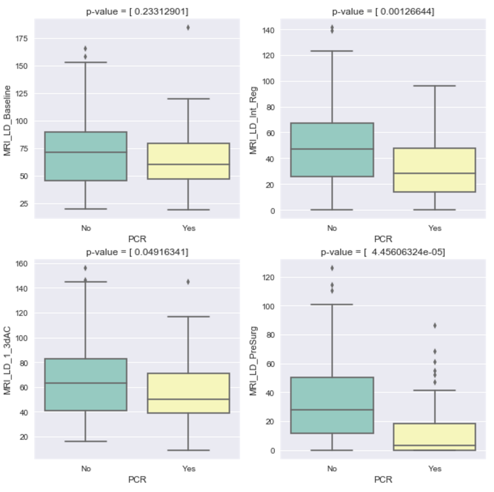

which indicate that all low MRI measurements with the exception of `MRI_LD_Baseline` are statistically associated with `PCR`. However, an statistically significant result is not always clinically relevant, for that we need to look at the [effect size](https://en.wikipedia.org/wiki/Effect_size) (ES). The ES is defined as the ratio of the ratio of the mean for each group divide by the standard deviation of the entire data. As it can be seen below, the effect size for MRI measurements are small:

```Python
>>> mri_features = ['MRI_LD_Baseline', 'MRI_LD_1_3dAC', 'MRI_LD_Int_Reg', 'MRI_LD_PreSurg']
>>> outcome = 'Alive'
# Effect Size
>>> inferential_statistics.effect_size( df, mri_features, outcome)
Effect Size
Predictor of Alive             
MRI_LD_Baseline        0.375046
MRI_LD_1_3dAC          0.357002
MRI_LD_Int_Reg         0.678682
MRI_LD_PreSurg         0.469548
```

-  Effect of MRI measurements on `Alive`: ANOVA

```Python
outcome = 'PCR'
R = inferential_statistics.anova_MRI(outcome, df);
```

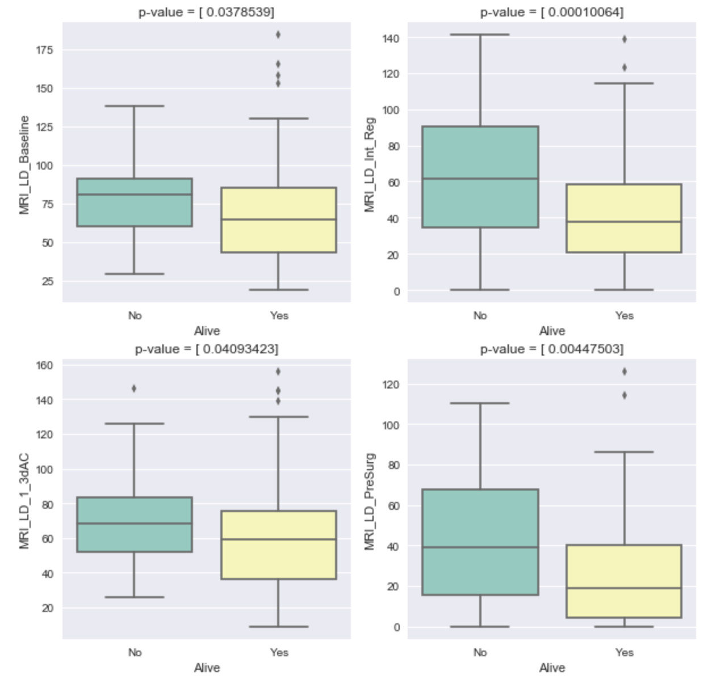

These results indicate that all all MRI measurements are statistically associated with survival (`Alive`), but it is also good practice to calculate the effect size to estimate how big the differences are between patients who survived and those who did not.

```Python
>>> mri_features = ['MRI_LD_Baseline', 'MRI_LD_1_3dAC', 'MRI_LD_Int_Reg', 'MRI_LD_PreSurg']
>>> outcome = 'Alive'

# Effect Size
>>> inferential_statistics.effect_size( df, mri_features, outcome)

Effect Size
Predictor of Alive             
MRI_LD_Baseline        0.375046
MRI_LD_1_3dAC          0.357002
MRI_LD_Int_Reg         0.678682
MRI_LD_PreSurg         0.469548
```
Finally, it is import to consider that only about 25% of all patients achieved `PCR` but even 56% did not achieve `PCR` they lived for the entire duration of the study (code below). Furthermore, these results do not indicate how long a patient will live on average (survival), not can be used to predict which patients will survive for the duration of the study (predictive). These two limitations will be addressed in the survival analysis and predictive statistics sections.

```Python
>>> f = lambda x:   100 * (  x /df.shape[0] )
>>> df['dummy'] = 1;
>>> df.groupby(['PCR','Alive']).count()['dummy'].apply(f)

PCR  Alive
No   No       16.666667
     Yes      56.547619
Yes  No        2.380952
     Yes      24.404762
```
## 6. Predictive Statistics
The objective of predictive_statistics is not make inferences about a patient population but making predictions for individual patients. Which at the end is what we want if medicine is going to personalized. In terms of the machine learning nomenclature, predictive is statistics is a supervised learning method, because we know features and outcomes for a particular collection of observations. Mainly, the observed outcomes are: 1) categorical, where we need to predictive if a particular patient belong to one or more groups (Alive  vs Not Alive, Cure vs not Cured, etc.), 2) continous, where we want to predictive the value of a continous variable for a patient. The analysis presented here is divided in the same manner. A toolbox to perform this analysis can be found at the Github [repository](https://github.com/JCardenasRdz/Insights-into-the-I-SPY-clinical-trial/blob/master/ispy1/predictive_statistics.py).

### 6. 1 Prediction of categorical outcomes
**Pathological Complete Response (`PCR`)**   
Unbalanced samples are one of the main challenges in supervised classification learning. An unbalance sample when the number of observations in class of `N` possible outcomes makes the majority of the observations. Unfortunately, this imbalance is very common in health care, thus we need to confirm how unbalanced our sample for `PCR` is:

```Python
# modules
import pandas as pd
import matplotlib.pyplot as plt
# data
df = pd.read_csv('./data/I-SPY_1_clean_data.csv')
# plot
# check how unbalanced the data are
outcome = 'PCR'
df[outcome].value_counts(normalize = True).plot.barh();
plt.title('Normalized Sample size for PCR')
plt.xlabel('group size (%)');
plt.show();
```
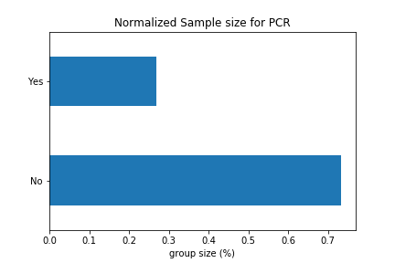

We can see that 70% of the patients did not achieve `PCR`, is almost 2X more unbalanced than we want (50% split is ideal). A way to deal with this imbalance is to oversample the class with the fewest observations. This oversampling can be performed using the [imbalanced-learn python library](http://contrib.scikit-learn.org/imbalanced-learn/install.html), but first we need to allocate predictors and outcomes to match the format needed by _scikit-learn_:
```Python
# package by Julio
from ispy1 import predictive_statistics

# allocate continous predictors
cont_predictors = ['age','MRI_LD_Baseline', 'MRI_LD_1_3dAC', 'MRI_LD_Int_Reg', 'MRI_LD_PreSurg']
X_cont = df[cont_predictors].values

# allocate clinical predictors
cat_predictors = ['White', 'ER+', 'PR+', 'HR+'];
X_cat = pd.pandas.get_dummies(df[cat_predictors], drop_first=True).values

# allocate a single predictors matrix X
X = np.concatenate( (X_cont, X_cat), axis=1)

# allocate  outcome
outcome = 'PCR'
y = predictive_statistics.labels_to_numbers(df, outcome);    
```
Now, we can perform `Logistic Regression` on the combined categorical and continous predictors. I used the `GridSearchCV` module to find the logistic regression parameters that maximize `Cohen's Kappa` (which is a good metric for unbalanced samples).

**why kappa is a good metric for classifiers**   
A possible scenario is to have a classifier that predicts that 44 / 45 `PCR` belong to the class with the largest number of cases (`PCR` = No). As you can see in the following code, `AUC` and `accuracy` are very misleading metrics to measure the performance of a classifier, because

```Python
from sklearn import metrics
def mymetrics(ypredicted, yexpected):
    print(metrics.classification_report(ypredicted, yexpected))
    k = metrics.cohen_kappa_score(ypredicted, yexpected); k = np.round(k,3);
    auc = metrics.roc_auc_score(ypredicted, yexpected);   auc  = np.round(auc,3);
    accuracy = metrics.accuracy_score(ypredicted, yexpected); accuracy = np.round(accuracy,3);

    print("Kappa = " + str(k))
    print("AUC = " + str(auc))
    print("Accuracy = " + str(accuracy))

# make at least one observation positive
>>> y_crazy = np.zeros_like(y)
>>> y_crazy[np.argwhere(y>0)[0]] = 1
>>> mymetrics(y_crazy, y)

precision    recall  f1-score   support

         0       1.00      0.74      0.85       167
         1       0.02      1.00      0.04         1

avg / total       0.99      0.74      0.84       168

Kappa = 0.032
AUC = 0.868
Accuracy = 0.738
```

The following code snippet shows the `Logistic_Regression` function inside `ispy1.predictive_statistics`.

```Python
def Logistic_Regression(Xdata, Ydata, oversample = False, K_neighbors = 4):
    '''
    Perform Logistic Regression optimizing C, penalty, and fit_intercept to maximize
    Cohen kappa (min  = -1, max = 1.0)
    '''

    # split data
    X_train, X_test, y_train, y_test = split_data(Xdata,Ydata, oversample, K_neighbors)

    # train and tune parameters using GridSearchCV
    pars= dict(   C = np.arange(.01,100,.1),
                  penalty = ['l2', 'l1'],
                  fit_intercept = [True,False])

    grid =  GridSearchCV(  linear_model.LogisticRegression(), param_grid = pars,
                           scoring = metrics.make_scorer(metrics.cohen_kappa_score),
                           cv= 5, verbose = 0, n_jobs = -1)

    # fit
    grid.fit(X_train,y_train)

    # metrics
    auc, kappa, fpr, tpr = binary_classifier_metrics(grid, X_train, y_train, X_test, y_test)

    # output
    return auc, kappa, fpr, tpr
```
Running `Logistic Regression` without oversampling yields the following results for `PCR`:

```Python
>>> auc1, kappa1, fpr1, tpr1 = predictive_statistics.Logistic_Regression(X, y, oversample = False)
precision    recall  f1-score   support

  0       0.77      0.87      0.82        39
  1       0.29      0.17      0.21        12

avg / total       0.66      0.71      0.68        51

The estimated Cohen kappa is 0.0449438202247
The estimated AUC is 0.519
============================================================
```
Because `AUC` is close to 0.50 and `kappa` is close to 0.0, we can say that these results indicate that the observed performance of  logistic regression is very close to what we would expect by just flipping a coin (50% chance).
On the other hand, running logistic regression with oversampling yields a better result:

```Python
>>> auc2, kappa2, fpr2, tpr2 = predictive_statistics.Logistic_Regression(X, y, oversample = True, K_neighbors = 4)
Data was oversampled using the ADASYN method
             precision    recall  f1-score   support

          0       0.82      0.72      0.77        39
          1       0.35      0.50      0.41        12

avg / total       0.71      0.67      0.68        51

The estimated Cohen kappa is 0.190476190476
The estimated AUC is 0.609
============================================================
```
The details for the implementation of oversampling by ADASYN can be found in the `split_data` function of `ispy1.predictive_statistics`. Next, we can compare the ROC curves for the oversampled and and standard logistic regression of `PCR`:

```Python
title ='Effect of oversampling on Logistic Regression for PCR'
predictive_statistics.plot_compare_roc(fpr1, tpr1,fpr2, tpr2, auc1, auc2, title = title)
```
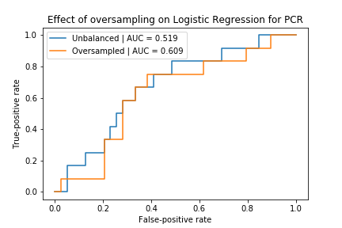

A random forest classifier was also implemented with and without oversampling. Please see `predictive_statistics.RandomForest_Classifier` for further details.
```Python
>>> auc1, kappa1, fpr1, tpr1, forest = predictive_statistics.RandomForest_Classifier(X, y)
precision    recall  f1-score   support

         0       0.80      0.92      0.86        39
         1       0.50      0.25      0.33        12

avg / total       0.73      0.76      0.73        51

The estimated Cohen kappa is 0.209302325581
The estimated AUC is 0.587
============================================================

>>> auc2, kappa2, fpr2, tpr2, Forest = predictive_statistics.RandomForest_Classifier(X, y, oversample=True, K_neighbors = 2)

Data was oversampled using the ADASYN method
             precision    recall  f1-score   support

          0       0.81      0.90      0.85        39
          1       0.50      0.33      0.40        12

avg / total       0.74      0.76      0.75        51

The estimated Cohen kappa is 0.260869565217
The estimated AUC is 0.615
============================================================
```
These results indicate that oversampling has a very small benefit for random forest classifiers.


**Survival (`Alive`)**   
A similar approach can be used for survival, and we can see that `Alive` is even more unbalanced than `PCR`. With about 80% of the subjects surviving until the end of the study.

```Python
# allocate  outcome
>>> outcome = 'Alive'
>>> y = predictive_statistics.labels_to_numbers(df, outcome);

# check how unbalanced the data are
>>> df[outcome].value_counts(normalize = True).plot.barh();
>>> plt.title('Normalized Sample size for Alive')
>>> plt.xlabel('group size (%)')
```
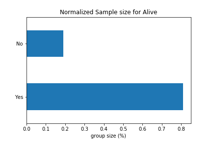

As before, we can run use logistic regression and random forest to predict survival [`Alive`].

```Python
# standard Logistic Regression
>>> auc1, kappa1, fpr1, tpr1 = predictive_statistics.Logistic_Regression(X, y)

precision    recall  f1-score   support

         0       0.50      0.27      0.35        11
         1       0.82      0.93      0.87        40

avg / total       0.75      0.78      0.76        51

The estimated Cohen kappa is 0.236734693878
The estimated AUC is 0.599
============================================================

# unbalanced learning
>>> auc2, kappa2, fpr2, tpr2 = predictive_statistics.Logistic_Regression(X, y, oversample=True, K_neighbors = 4)

Data was oversampled using the ADASYN method
             precision    recall  f1-score   support

          0       0.36      0.45      0.40        11
          1       0.84      0.78      0.81        40

avg / total       0.73      0.71      0.72        51

The estimated Cohen kappa is 0.208893485005
The estimated AUC is 0.615
============================================================

>>> title ='Effect of oversampling on Logistic Regression for Alive'
>>> predictive_statistics.plot_compare_roc(fpr1, tpr1,fpr2, tpr2, auc1, auc2, title = title)
```
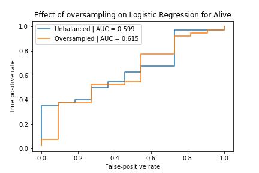

while the code and results for a random forest classifier are:

```Python
>>> auc1, kappa1, fpr1, tpr1, _= predictive_statistics.RandomForest_Classifier(X, y)
precision    recall  f1-score   support

          0       0.38      0.27      0.32        11
          1       0.81      0.88      0.84        40

avg / total       0.72      0.75      0.73        51

The estimated Cohen kappa is 0.16393442623
The estimated AUC is 0.574
============================================================

>>> auc2, kappa2, fpr2, tpr2, _= predictive_statistics.RandomForest_Classifier(X, y, oversample=True, K_neighbors = 6)
Data was oversampled using the ADASYN method
             precision    recall  f1-score   support

          0       0.67      0.36      0.47        11
          1       0.84      0.95      0.89        40

avg / total       0.81      0.82      0.80        51

The estimated Cohen kappa is 0.375510204082
The estimated AUC is 0.657
============================================================

>>> title ='Effect of oversampling on RFC for PCR'
>>> predictive_statistics.plot_compare_roc(fpr1, tpr1,fpr2, tpr2, auc1, auc2, title = title)
```
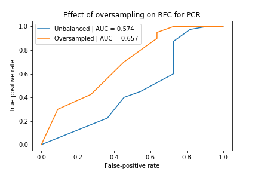

oversampling does not have an effect on the average results and causes an important increment in the precision, recall, and for the negative group, and improves AUC and kappa.   

**Survival (`Alive`) including `PCR` as predictor**
The most important clinical outcome in cancer is how long a patient lives after being treated, or if he/she is alive at the end of a study, with that in mind I included `PCR` as a predictor of survival. This makes sense given the study design.

- Logistic Regression
```Python
# allocate new predictor variable
>>> pcr = predictive_statistics.labels_to_numbers(df, 'PCR').reshape(168,1)
>>> newX = np.concatenate((X,pcr), axis  = 1)
# standard LG
>>> auc1, kappa1, fpr1, tpr1 = predictive_statistics.Logistic_Regression(newX, y)

precision    recall  f1-score   support

         0       0.43      0.27      0.33        11
         1       0.82      0.90      0.86        40

avg / total       0.73      0.76      0.74        51

The estimated Cohen kappa is 0.198952879581
The estimated AUC is 0.586
============================================================

>>> # unbalanced learning
>>> auc2, kappa2, fpr2, tpr2 = predictive_statistics.Logistic_Regression(newX, y, oversample=True, K_neighbors = 10)

Data was oversampled using the ADASYN method
             precision    recall  f1-score   support

          0       0.38      0.45      0.42        11
          1       0.84      0.80      0.82        40

avg / total       0.74      0.73      0.73        51

The estimated Cohen kappa is 0.238805970149
The estimated AUC is 0.627
============================================================
```
- RandomForest_Classifier
```Python
>>>  auc1, kappa1, fpr1, tpr1 , _ = predictive_statistics.RandomForest_Classifier(newX, y)

precision    recall  f1-score   support

          0       0.33      0.09      0.14        11
          1       0.79      0.95      0.86        40

avg / total       0.69      0.76      0.71        51

The estimated Cohen kappa is 0.0555555555556
The estimated AUC is 0.52
============================================================

>>> auc2, kappa2, fpr2, tpr2, _ = predictive_statistics.RandomForest_Classifier(newX, y, oversample=True, K_neighbors = 10)

Data was oversampled using the ADASYN method
             precision    recall  f1-score   support

          0       0.38      0.45      0.42        11
          1       0.84      0.80      0.82        40

avg / total       0.74      0.73      0.73        51

The estimated Cohen kappa is 0.238805970149
The estimated AUC is 0.627
============================================================
```

As it can be seen above, including `PCR` only does not provide a significant improvement for Logistic nor RandomForest Classifier. Thus, if we to include information about surgery, it might be better to include the residual cancer burden `RCB`.

**Survival (`Alive`) including `RCB` as a predictor**
First, we need to create a new matrix of predictors with `RCB` append at the end:

```Python
>> rcb = pd.get_dummies(df['RCB']).values
>>> newX = np.concatenate((X,rcb), axis  = 1)
```
next, we can perform logistic regression and random forest classification without oversampling.

```Python
>>> auc1, kappa1, fpr1, tpr1 = predictive_statistics.Logistic_Regression(newX, y)

precision    recall  f1-score   support

          0       0.50      0.36      0.42        11
          1       0.84      0.90      0.87        40

avg / total       0.76      0.78      0.77        51

The estimated Cohen kappa is 0.292559899117
The estimated AUC is 0.632
============================================================

>>> auc2, kappa2, fpr2, tpr2, _= predictive_statistics.RandomForest_Classifier(newX, y)
precision    recall  f1-score   support

          0       0.50      0.45      0.48        11
          1       0.85      0.88      0.86        40

avg / total       0.78      0.78      0.78        51

The estimated Cohen kappa is 0.340775558167
The estimated AUC is 0.665
============================================================
```
The random forest classifier performs slightly better than logistic regression but not much, their ROC curves compare as follows:
```Python
# compare
>>> title ='Predicting Survival including RCB as a predictor'
>>> predictive_statistics.plot_compare_roc(fpr1, tpr1,fpr2, tpr2, auc1, auc2, title = title)
>>> plt.legend(['Logistic Regression','Random Forest Classifier']);
```
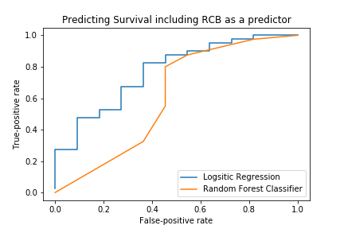

What we can do next is to test the effect of oversampling using ADASYN:

```Python
>>> auc3, kappa3, fpr3, tpr3 = predictive_statistics.Logistic_Regression(newX, y, oversample=True, K_neighbors = 4)

Data was oversampled using the ADASYN method
             precision    recall  f1-score   support

          0       0.33      0.45      0.38        11
          1       0.83      0.75      0.79        40

avg / total       0.73      0.69      0.70        51

The estimated Cohen kappa is 0.180722891566
The estimated AUC is 0.602
============================================================

>>> auc4, kappa4, fpr4, tpr4, _= predictive_statistics.RandomForest_Classifier(newX, y, oversample=True, K_neighbors = 4)
Data was oversampled using the ADASYN method
             precision    recall  f1-score   support

          0       0.30      0.27      0.29        11
          1       0.80      0.82      0.81        40

avg / total       0.70      0.71      0.70        51

The estimated Cohen kappa is 0.101057579318
The estimated AUC is 0.549
============================================================
```

As we observed for other cases, including oversampling using ADASYN does not improve things much or in this case, makes it a little worse, suggesting that this approach does not generalize properly.    

### 6. 2 Prediction of continous outcomes
The analysis of survival in the previous section was aimed at predicting if a patient will live to the end of the study, but that does not tell us how long they lived (which is what matters), nor how long the patient was relieved from cancer. These two questions are tackled in the following sections. But first, we need to organize the data to perform the analysis.

```Python
>>> cont_predictors = ['age','MRI_LD_Baseline', 'MRI_LD_1_3dAC', 'MRI_LD_Int_Reg', 'MRI_LD_PreSurg']
>>> contX = df[cont_predictors].values
>>> cat_pred = ['PCR','White', 'ER+', 'PR+', 'HR+'];
>>> catX = pd.pandas.get_dummies(df[cat_pred], drop_first=True).values
>>> X = np.concatenate( (catX, contX), axis=1)
```

**Recurrence-Free Survival (`RFS`, Continous in months)**   
Recurrence-Free Survival (`RFS`) is the length of time after primary treatment for a cancer ends that the patient survives without any signs or symptoms of that cancer. The following regression methods will be used to construct a model to predict `RFS` after splitting the data in train and test:

1. Ordinary Linear Least square fitting
2. ElasticNet
3. SVM regression
4. Random Forest regression

as we did in the previous section, all predictors were fine tuned using `RandomizedSearchCV` for regressor 2 to 4, but oversampling is not needed for regression. The code an outputs are shown next

```Python
>>> y = df.RFS.values / 30; # conver to months
>>> X_train, X_test, y_train, y_test = predictive_statistics.split_data(X, y, False)
```

- Ordinary Linear Least square fitting

```Python
>>> predictive_statistics.lsq(X_train, y_train, X_test, y_test, outcome =' Recurrence-Free Survival (months)')
OLS Regression Results                            
==============================================================================
Dep. Variable:                      y   R-squared:                       0.870
Model:                            OLS   Adj. R-squared:                  0.858
Method:                 Least Squares   F-statistic:                     71.68
Date:                Tue, 20 Jun 2017   Prob (F-statistic):           8.95e-43
Time:                        08:39:03   Log-Likelihood:                -502.27
No. Observations:                 117   AIC:                             1025.
Df Residuals:                     107   BIC:                             1052.
Df Model:                          10                                         
Covariance Type:            nonrobust                                         
==============================================================================

================================================================================
The median absolute error for testing data set of  Recurrence-Free Survival (months) is: 14.354
================================================================================
```

- ElasticNet

```Python
>>> predictive_statistics.ElasticNet(X_train, y_train, X_test, y_test, outcome =' Recurrence-Free Survival (months)')
================================================================================
The median absolute error for testing data set of  RFS (months) is: 12.737
================================================================================
```

- SVM Regression

```Python
>>> predictive_statistics.svr(X_train, y_train, X_test, y_test, outcome =' RFS(months)')

================================================================================
The median absolute error for testing data set of  RFS(months) is: 12.288
================================================================================
```


- Random Forest Regressor

```Python
>> predictive_statistics.RandomForestRegressor(X_train, y_train, X_test, y_test, outcome =' RFS(months)')
================================================================================
The median absolute error for testing data set of  RFS(months) is: 14.88
================================================================================
```


**`Survival Length` (continous in months)**   
The same approach used for `RFS` can be used to construct a model to predict how long the patient will leave after the complete
cycle of therapy has been completed. The results are summarized in the table below.

| Method            | Mean Absolute Error Survival |
|-------------------|------------------------------|
| Linear Regression | 15.82                        |
| SVR               | 102.82                       |
| ElasticNet        | 9.136                        |
| RandomForest      | 9.254                        |

As before, linear regression performs really well despite its simplicity, and its error is ~56% than more complex methods such as `ElasticNet` and `RandomForest`. `ElasticNet` is a linear model that combines the L1 and L2 penalties of the lasso and ridge methods.
